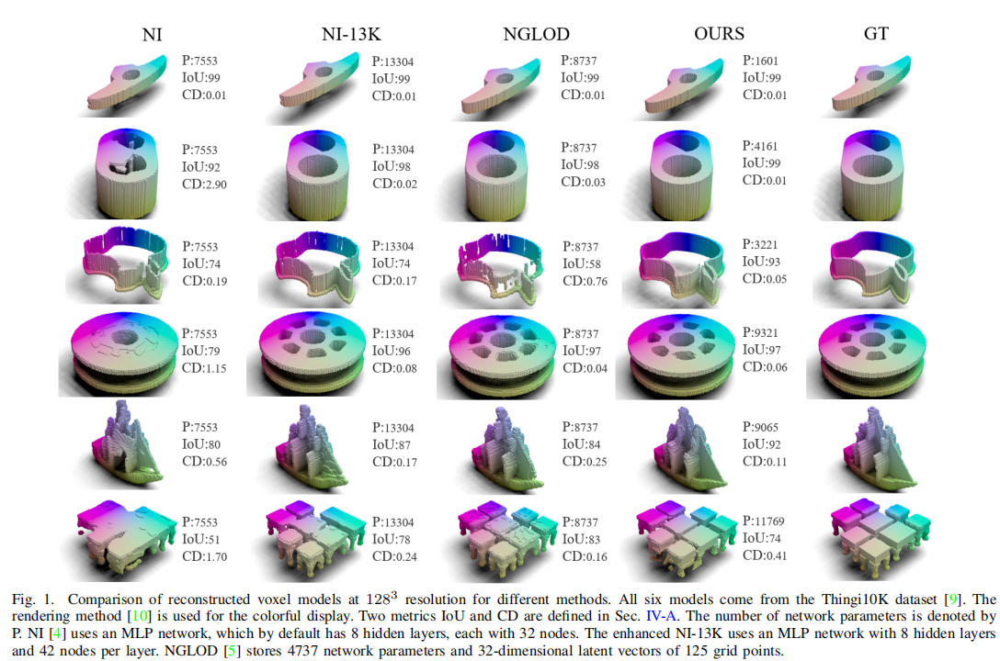
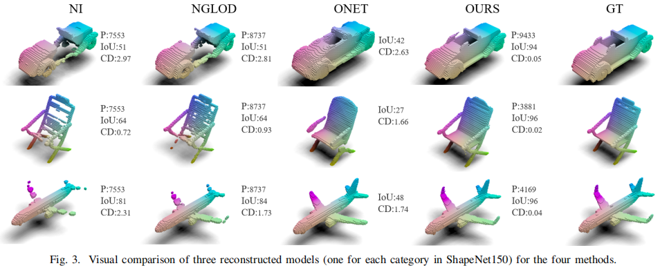
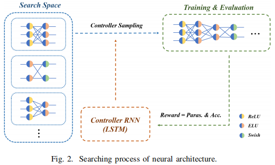
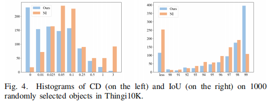
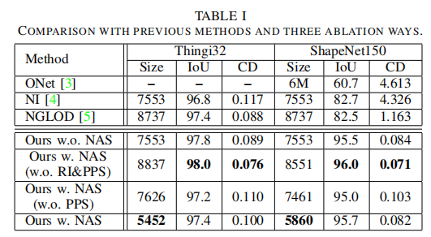

# An Efficient End-to-End 3D Model Reconstruction based on Neural Architecture Search.
Yongdong Huang, Yuanzhan Li, Xulong Cao and Siyu Zhang, Shen Cai∗ , Ting Lu,Yuqi Liu.An Efficient End-to-End 3D Model Reconstruction
based on Neural Architecture Search.

## Methodology
we complete the end-to-end network by classifying binary voxels.
Compared to other signed distance field (SDF) prediction or
binary classification networks, our method achieves significantly
higher reconstruction accuracy using fewer network parameters.



[3] L. Mescheder, M. Oechsle, M. Niemeyer, S. Nowozin, and A. Geiger,
“Occupancy networks: Learning 3d reconstruction in function space,”
in IEEE/CVF Conference on Computer Vision and Pattern Recognition
(CVPR), 2019, pp. 4455–4465.

[4] T. Davies, D. Nowrouzezahrai, and A. Jacobson, “On the effectiveness of weight-encoded neural implicit 3d shapes,” arXiv preprint
arXiv:2009.09808, 2020.

[5] T. Takikawa, J. Litalien, K. Yin, K. Kreis, C. Loop, D. Nowrouzezahrai,
A. Jacobson, M. McGuire, and S. Fidler, “Neural geometric level of
detail: Real-time rendering with implicit 3d shapes,” in IEEE/CVF
Conference on Computer Vision and Pattern Recognition (CVPR), 2021,
pp. 11 353–11 362.
## Network


## Experiment


## Results

## Dataset
We use [Shapenet](https://shapenet.org/download/shapenetcore) and [Thingi10k](https://ten-thousand-models.appspot.com/) datasets, both of which are available from their official website. [Thingi32]( https://github.com/nv-tlabs/nglod/issues/4) is composed of 32 simple shapes in Thingi10K. [ShapeNet150]( https://github.com/nv-tlabs/nglod/issues/4) contains 150 shapes in the ShapeNet dataset.


## Getting started

### Training
```bash
cd ./
bash train.sh
```

### Evaluation
```bash
python eval.py
```

### Ubuntu and CUDA version
We verified that it worked on ubuntu18.04 cuda10.2

### Python dependencies